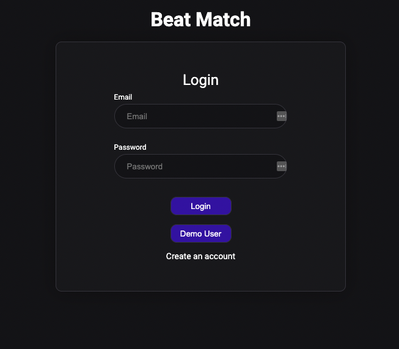
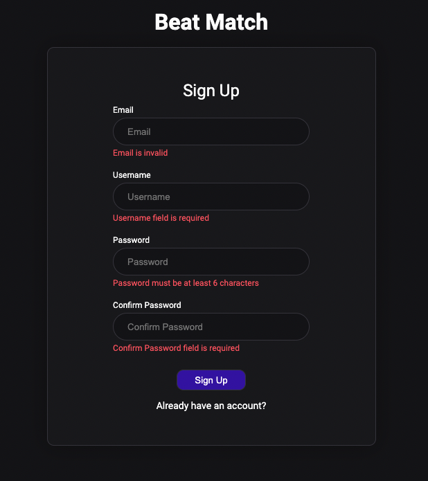
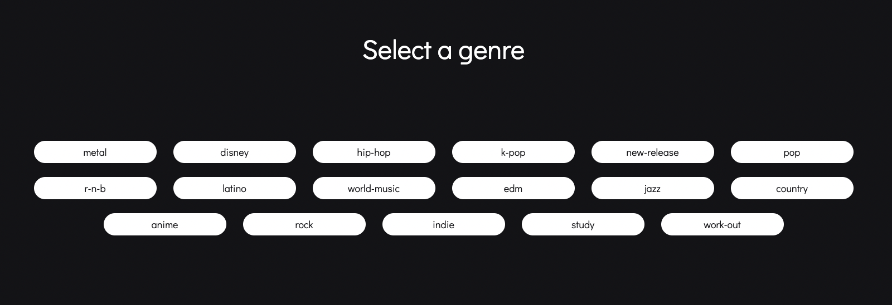
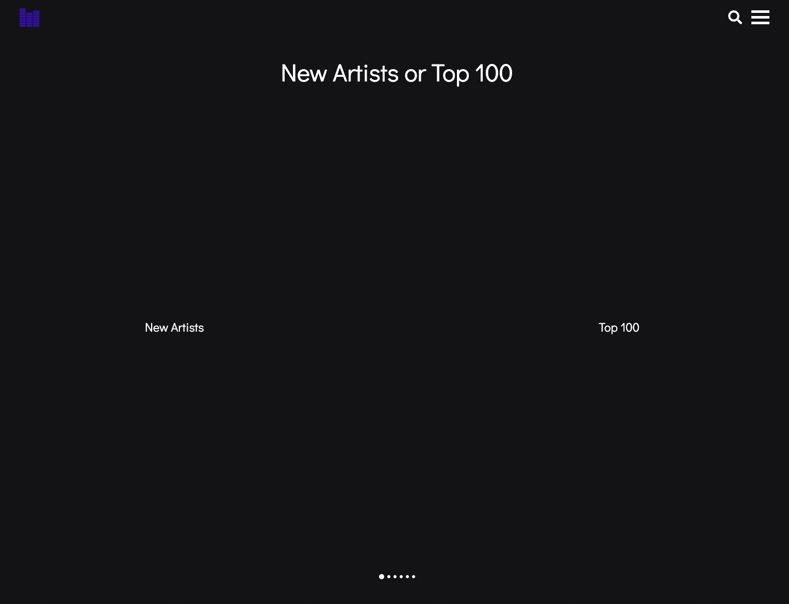
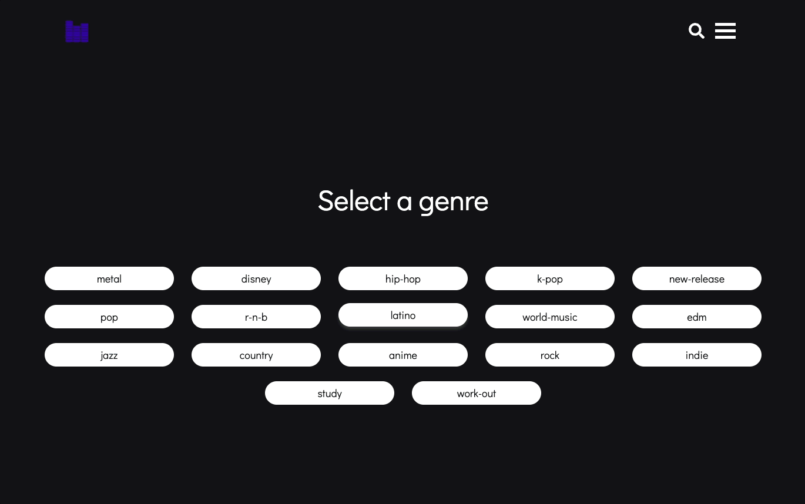

# Beat Match
Find the beat that matches you.

# Background and Overview
Beat Match is a web application where users can pick a genre and fill out a short form about their personality to create the perfect playlist for them using Spotify's API. Users can save, play, share with friends, and export to the playlist to Spotify. Additionally, users can follow their friends on Beat Match to see what playlist's they have been making.

## Features

### User Authentication

* Users can login with a demo user or with their own credentials

* Errors on login/signup show on incorrect submission

### Playlist Generation

* Users can select a genre before beginning

* Users will be prompted with a set of questions that each relate to the playlists attributes

### Search and Follow
* Users can search for other users
* Users can follow each other 

## Members
* [Zeki Kural](https://github.com/zkural1) Project Lead/Flex Developer
* [Farzam Ahmad](https://github.com/FarzamA) Backend Lead
* [Alberto Young](https://github.com/alyoung1991) Frontend Lead
* [Elliot Wilson](https://github.com/elliot-wilson) Flex Developer
